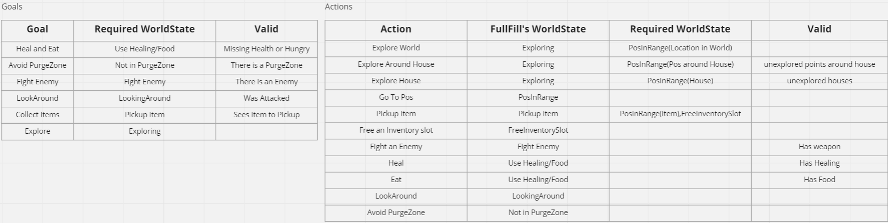

# ZombieGame
## Topic: Goal Oriented Action Plan (GOAP)
GOAP for AI means that the AI has a list of __goals__. A __goal__ is reached when the world is in a certain __WorldState__ called __Required WorldState__. A __Goal__ also has to be __Valid__. For example a goal KillEnemy is only valid when there is an enemy. Once the AI has found a __Valid Goal__ it will look for an __Action__ that can fullfill the __Required WorldState__ of the __goal__. __Actions__ consist of a __WorldState__ they fullfill called __FullFill WorldState__, an __IsValid__ check to see if the action should be persued and can have an __Required WorldState__. So if we found an Action That fullfills the __Required WorldState__ we check if it is __Valid__, then we check if it has a __Required WorldState__ if it has one we will first need to find an __Action__ to fullfill the __Required WorldState__ of the previous __Action__. The AI will keep going through __Actions__ until it finds one that is __Valid__ and has a fullfilled __Required WorldState__ or no __Required WorldState__, this __Action__ will then be performed. If no performable __Action__ is found the AI will try to reach the next __Goal__ in the list.



## Implementation
I implemented GOAP using struct for my Goals and Actions, first i wanted to use a base class for goals and actions. But i ran into an error that made me try structs instead of classes, in the end the error had nothing to do with the classes, but i did't want to rewrite the code.
###### Goal
```
struct Goal
{
	std::string Name;
	const std::function<bool()> IsValid;
	const WorldState requiredWorldState;
};
```
###### Action
```
struct Action
{
	std::string Name;
	std::function<bool()> IsValid;
	std::function<void()> Perform;
	WorldState fullFillWorldState;
	std::vector<WorldState> requiredWorldState;
};
```
## Result
The AI's goals and Actions


## Conclusion
Ones you figure out a framework it becomes easy to add more actions and goals. A problem that i came across is that you can't really perform multiple actions at once.
The __Action Fight Enemy__ has to avoid the enemy, look at the enemy and shoot if in looking at it. These tree seperate things have to be done all at once so they can't be split up into different actions. 
Using classes would probably also make the code more readable.
